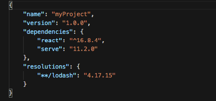

## Handling False Positives

Vulnerabilities may fail your CI pipeline even if you consider them as false positives. This section will guide you to overcome this situation when handling issues.

## .huskyci

A file named `.huskyci` can be placed on your project's root directory to be read and have it's contents ignored by a huskyCI analysis. To create this file, you can follow the example below:

```sh
[huskyCI-Ignore]

# Bandit ignore:
tests/

# Safety igonre:
vendor/

# Gosec ignore:
api/server.go
```

A `.huskyci` file must have a `[huskyCI-Ignore]` header, so it can be recognized by huskyCI, after that, all folders or files will be removed from future analyses. It's important to notice that the file path is relative to the project's root directory and adding comments in between entries serves only as a way of better organizing.

**Note:** Not all security tests currently support this feature, for more information on which are supported, please visit this [GitHub issue](https://github.com/globocom/huskyCI/issues/461):

## False positives generated by Yarn Audit

When running the [yarn audit](https://classic.yarnpkg.com/en/docs/cli/audit/) security test, even though being told explicitly by huskyCI not to include sub-dependencies, some might appear in the final output. In order to overcome this issue, it is possible to modify your project's `package.json` file in order to define version overrides.

### How to use it?

Add a `resolutions` field to your `package.json` file and define your version overrides, as shown by the image below:

<p align="center"> 

</p>

Then simply run `yarn install`. It's important to notice that if you define an invalid `resolution`, such as invalid package name or invalid version range, you will receive a warning.

`yarn audit` official documentation available [here](https://classic.yarnpkg.com/en/docs/selective-version-resolutions/).

## False positives generated by GitLeaks

### .gitleaks.toml

As huskyCI uses [`gitleaks`](https://github.com/zricethezav/gitleaks) to audit git repositories for secrets, a `.gitleaks.toml` file can be used to add an allow list when needed. To do that, simply add this file into the root of your repository, as the following example:

```yml
title = "huskyCI gitleaks config"
[whitelist]
files = [
    "(.*?)(jpg|gif|doc|pdf|bin)$",
    "^vendor/(.*?)$",
    ".gitleaks.toml",
]
commits = [
    "444f28d5437ad3127702bf1b0779ae6cd00ab146",
]
```

### Files

The following examples can be used to include files into the allow list using regex, as follows:

```yml
files = [
    "(.*?)(jpg|gif|doc|pdf|bin)$",
    "^vendor/(.*?)$",
    ".gitleaks.toml",
]
```

* `(.*?)(jpg|gif|doc|pdf|bin)$` will not consider any file that has these specific extensions.
* `^vendor/(.*?)$` will not consider any file inside the `vendor/` folder.
* `.gitleaks.toml` will not consider this particular file into the scan.

### Commits

The following example can used to include a particular commit into the allow list, as follows:

```yml
commits = [
    "444f28d5437ad3127702bf1b0779ae6cd00ab146",
]
```  


### Example

Imagine that you have a `connect.go` file in your git repository with the commit hash `444f28d5437ad3127702bf1b0779ae6cd00ab146`:

```go
func ConnectDB() error {

    username := "root"
    password := "*hb123:0l"
    host := "http://myinternal.url.to.host"
    port := "3360"

    err := mongoConnect(username, password, host, port)

    return err
}
```

After mitigating the vulnerability by invalidating the password, using a new one, and adding environment variables logic, your new code can look like this:

```go
func ConnectDB() error {

    username :=  os.Getenv("DB_USER")
    password := os.Getenv("DB_PASSWORD")
    host := os.Getenv("DB_HOST")
    port := os.Getenv("DB_PORT")

    err := mongoConnect(username, password, host, port)

    return err
```

When running huskyCI again, you may realize that [`gitleaks`](https://github.com/zricethezav/gitleaks) will still fail your CI, because the old commit `444f28d5437ad3127702bf1b0779ae6cd00ab146` stills has credentials in it. 

The point is: you should **NOT** whitelist the `connect.go` file into  `.gitleaks.toml`! By doing that, any new hardcoded passwords in this file will not be checked anymore. The correct way is to add the commit itself:

```yml
title = "huskyCI gitleaks config"
[whitelist]
commit = [
    "444f28d5437ad3127702bf1b0779ae6cd00ab146",
]
```